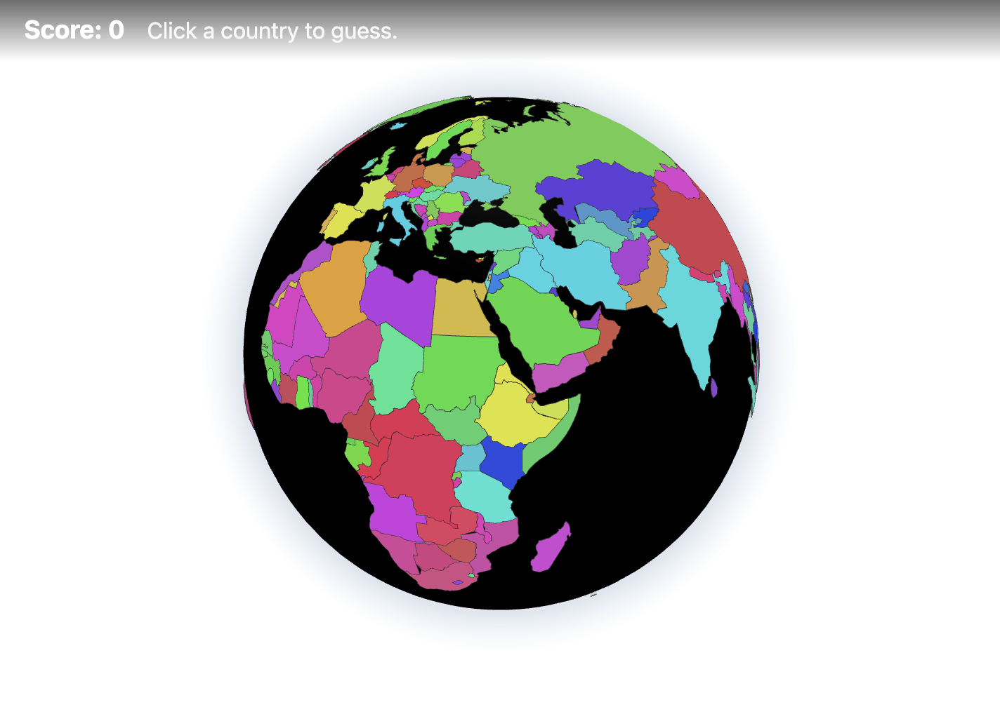

# Worldle

A geography game: rotate and zoom a 3D globe, click a country (shown in different colors, no labels), then type its English name. Correct guesses earn points; less well-known countries are worth more.

**Play online:** [https://thomasgmeinder.github.io/guess_the_country/](https://thomasgmeinder.github.io/guess_the_country/)



## Run locally

```bash
npm install
npm run dev
```

Open the URL shown in the terminal (e.g. http://localhost:5173).

## Build

```bash
npm run build
```

Output is in `dist/`.

## How it works

- **Globe:** [three-globe](https://github.com/vasturiano/three-globe) + Three.js; country boundaries from [Natural Earth](https://www.naturalearthdata.com/) (110m GeoJSON).
- **Click:** Raycast to the globe → lat/lng → point-in-polygon ([Turf](https://turfjs.org/)) to find the country.
- **Scoring:** Tier 1 (most populous ~20) = 10 pts, Tier 2 (next ~50) = 25 pts, rest = 50 pts.

## Tech stack

React 18, TypeScript, Vite, Three.js, three-globe, @turf/boolean-point-in-polygon.

## GitHub Pages

The app is deployed to GitHub Pages on every push to `main`. Enable it once in the repo **Settings → Pages**: set **Source** to **GitHub Actions**. The workflow (`.github/workflows/deploy.yml`) builds the app and deploys the `dist/` folder.
